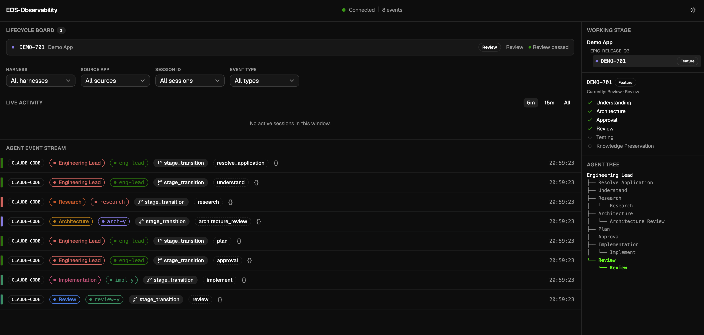
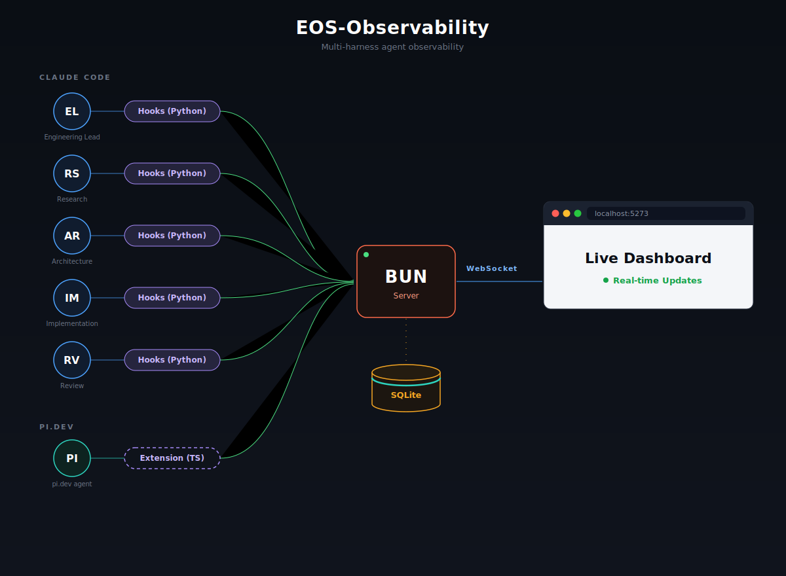

# EOS-Observability

Real-time event ingestion, session tracking, and dashboards for AI-assisted
engineering work across Claude Code and pi.dev.



## Architecture



## What this does

Watches AI coding agents work in real time — every tool call, prompt, and
session across whichever CLI harness you're using — and shows it as a live
dashboard, tagged by which [`eos/`](../eos) lifecycle stage and role produced
it, not just a raw tool-call log.

## Why

Agentic engineering work is otherwise opaque: multiple agents running across
multiple tools, with no shared view of who's doing what or where a ticket
actually stands. This gives that view, and it's built to track *any* CLI
harness through one normalized event model, not just one vendor's.

## How

- **`apps/server`** — Bun + `bun:sqlite`, filtered/paginated queries, live WebSocket broadcast
- **`apps/client`** — Vite + React + shadcn/ui dashboard
- **`apps/adapters/claude-code`** — Python hook scripts, run via `uv`
- **`apps/adapters/pi`** — TypeScript extension for pi.dev (not yet built)

### Run it

Requires [Bun](https://bun.sh).

```bash
# Terminal 1 — server (http://localhost:4100)
cd apps/server && bun install && bun run start

# Terminal 2 — client (http://localhost:5273)
cd apps/client && bun install && bun run dev
```

### Connect a harness

- **Claude Code** — copy `apps/adapters/claude-code/` into a project's
  `.claude/hooks/`. Full steps: [`apps/adapters/claude-code/README.md`](apps/adapters/claude-code/README.md).
- **pi.dev** — planned, not yet built (see that directory for design notes).
