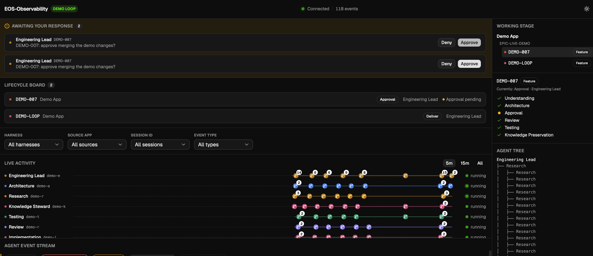

# EOS-Observability

Real-time event ingestion, session tracking, and dashboards for AI-assisted
engineering work — across any CLI harness, unified into one live view.


<figure>
  
  <figcaption>A pending Approval-gate request in the HITL inbox, with the Working Stage panel and per-ticket Agent Tree tracking the same ticket live.</figcaption>
</figure>

## What this does

Watches AI coding agents work in real time — every tool call, prompt, and
session across whichever CLI harness you're using — and surfaces it as a live
dashboard, tagged by which [EOS](https://github.com/kcwoodfield/eos) lifecycle
stage and role produced it, not just a raw tool-call log.

## Why

Agentic engineering work is otherwise opaque: multiple agents running across
multiple tools, with no shared view of who's doing what or where a ticket
actually stands. This gives that view, and it's built to track *any* CLI
harness through one normalized event model, not just one vendor's.

---

## Quick Start

> Get the server, dashboard, and at least one adapter running in under 5 minutes.
>
> **Just want to watch Claude Code work, step by step, no jargon?** →
> [`docs/claude-code-quickstart.md`](docs/claude-code-quickstart.md)

### Prerequisites

- [Bun](https://bun.sh) — server and client runtime
- [Astral uv](https://docs.astral.sh/uv/) — only needed for the Claude Code or Copilot CLI adapters (Python hook scripts)
- At least one AI CLI harness: [Claude Code](https://claude.ai/code), [GitHub Copilot CLI](https://docs.github.com/en/copilot/copilot-in-the-cli), or pi.dev

### 1. Start the server

```bash
cd apps/server && bun install && bun run start
# → http://localhost:4100
```

### 2. Start the dashboard

Open a second terminal:

```bash
cd apps/client && bun install && bun run dev
# → http://localhost:5273
```

### 3. Connect an adapter

The project you're watching — call it `your-project/` — is a **separate codebase from this one**, e.g. `/Users/you/code/your-project` while EOS-Observability lives at `/Users/you/code/eos-observability`. The adapter files get *copied into* `your-project/`, not run from here. Once copied, they're self-contained: no path back to this repo, no dependency on where it lives. The only thing connecting the two is a URL — the adapter POSTs to wherever the server (step 1) is listening, `localhost:4100` by default. If the server runs elsewhere (a different machine, a different port), pass `--server-url` on each hook command instead.

Each adapter is **independent** — install only the one(s) matching the harness(es) you use. They all speak the same normalized event format to the server, so any combination works simultaneously.

| Harness | Adapter source (in this repo) | Status |
|---|---|---|
| Claude Code | `apps/adapters/claude-code/` | ✅ Available |
| GitHub Copilot CLI | `apps/adapters/copilot-cli/` | 🚧 Planned |
| pi.dev | `apps/adapters/pi/` | 🚧 Planned |

**Claude Code (available now):**

1. Copy this repo's `apps/adapters/claude-code/` into `your-project/.claude/hooks/`
2. Copy `settings.json.example` → `your-project/.claude/settings.json` and set
   `YOUR_ROLE` to the agent identity (e.g. `"Engineering Lead"`)
3. Start a Claude Code session **in `your-project/`** — events stream to the
   dashboard in real time

Full setup: [`apps/adapters/claude-code/README.md`](apps/adapters/claude-code/README.md)

### 4. Tag events with EOS lifecycle stages _(optional)_

[EOS (Engineering Operating System)](https://github.com/kcwoodfield/eos) is a
process framework that defines how teams build software with AI — lifecycle
stages, roles, governance, and guardrails. Each event in EOS-Observability can
carry an EOS `stage`, `role`, and quality `gate`, turning a raw event stream
into a structured view of where work actually stands across agents and sessions.

Use `send_stage_transition.py` (Claude Code adapter) to emit stage transitions
at lifecycle boundaries. See [`apps/adapters/claude-code/README.md`](apps/adapters/claude-code/README.md#stage-transitions).

---

## Architecture


### Components

- **`apps/server`** — Bun + `bun:sqlite`, filtered/paginated queries, live WebSocket broadcast
- **`apps/client`** — Vite + React + shadcn/ui dashboard
- **`apps/adapters/claude-code`** — Python hook scripts wired via `.claude/settings.json`
- **`apps/adapters/copilot-cli`** — Python hook scripts wired via `.github/hooks/*.json` _(planned)_
- **`apps/adapters/pi`** — TypeScript in-process extension for pi.dev _(planned)_

---

## Implementation Brief: GitHub Copilot CLI Adapter

> Self-contained spec for building `apps/adapters/copilot-cli/` after hours.
> Verified against [GitHub Copilot hooks reference](https://docs.github.com/en/copilot/reference/hooks-reference).

### Goal

Mirror the `claude-code` adapter for GitHub Copilot CLI — hook into its
lifecycle events and POST the same normalized `ObservabilityEvent` envelope to
the server. The server and client require minimal changes.

### Hook event mapping

Copilot CLI uses camelCase event names; the PascalCase aliases (right column)
match what Claude Code already sends, so `event_type` values stay consistent
across harnesses.

| Copilot CLI event | Maps to `event_type` | Notes |
|---|---|---|
| `sessionStart` | `SessionStart` | payload: `sessionId`, `cwd`, `source`, `initialPrompt?` |
| `sessionEnd` | `SessionEnd` | payload adds `reason` (complete/error/abort/timeout/user_exit) |
| `userPromptSubmitted` | `UserPromptSubmit` | payload: `prompt` |
| `preToolUse` | `PreToolUse` | payload: `toolName`, `toolArgs` |
| `postToolUse` | `PostToolUse` | payload adds `toolResult.textResultForLlm` |
| `agentStop` | `Stop` | payload: `transcriptPath`, `stopReason` |
| `subagentStop` | `SubagentStop` | payload: `transcriptPath`, `agentName` |
| `preCompact` | `PreCompact` | payload: `transcriptPath`, `trigger`, `customInstructions` |
| `notification` | `Notification` | payload: `message`, `notificationType` |
| `errorOccurred` | `ErrorOccurred` | **New event type** — no Claude Code equivalent |

### Files to create

```
apps/adapters/copilot-cli/
├── send_event.py          # Main hook script (mirrors claude-code's send_event.py)
├── hooks.json.example     # Drop into .github/hooks/ or ~/.copilot/hooks/
├── utils/
│   ├── model_extractor.py # Reuse from claude-code if transcript format matches
│   └── token_usage.py     # Reuse from claude-code if transcript format matches
└── README.md              # Setup steps
```

### Files to change

| File | Change |
|---|---|
| `apps/server/src/types.ts` | Add `'copilot-cli'` to the `harness` union |
| `apps/client/src/lib/eventTypeMeta.ts` | Add icon for `ErrorOccurred` |

### Hook config format

Copilot CLI hooks live in `.github/hooks/*.json` (repo-level) or
`~/.copilot/hooks/*.json` (user-level), **not** in `settings.json`.
Each file must have both `bash` and `powershell` script variants:

```json
{
  "version": 1,
  "hooks": {
    "preToolUse": [{
      "type": "command",
      "bash": "uv run --script send_event.py --source-app YOUR_ROLE --event-type PreToolUse",
      "powershell": "uv run --script send_event.py --source-app YOUR_ROLE --event-type PreToolUse"
    }]
  }
}
```

### Key differences from the Claude Code adapter

1. **camelCase payloads** — Copilot CLI sends `sessionId`, `toolName`, `toolArgs`
   (not `session_id`, `tool_name`). The adapter normalizes these before posting.
2. **Cross-platform scripts** — hook entries need both `bash` and `powershell` fields.
3. **`transcriptPath` availability** — present on `agentStop`, `subagentStop`,
   `preCompact`. Format TBD (need a live session to inspect the JSONL schema before
   reusing the Claude Code token/model utils).
4. **`errorOccurred`** — fire-and-forget, no output processed; send as-is.
5. **`harness` value** — use `'copilot-cli'`.

### Open questions

- [ ] Does Copilot CLI's transcript JSONL match Claude Code's format closely enough
      to reuse `model_extractor.py` and `token_usage.py` unchanged?
- [ ] Does `agentStop` include model info anywhere in the payload or transcript?

---

## License

All rights reserved — see [`LICENSE`](LICENSE). Viewing is fine; reuse,
modification, or redistribution requires the copyright holder's permission.
